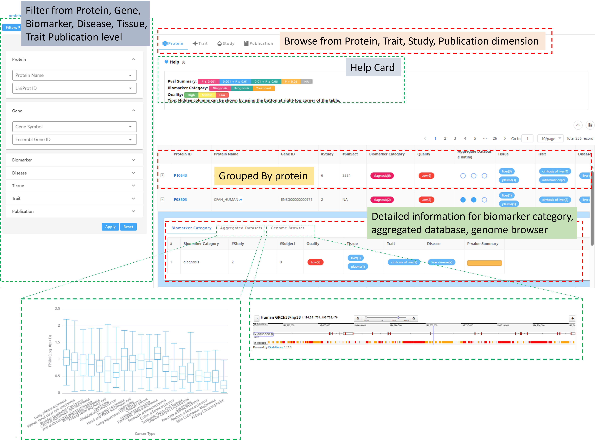
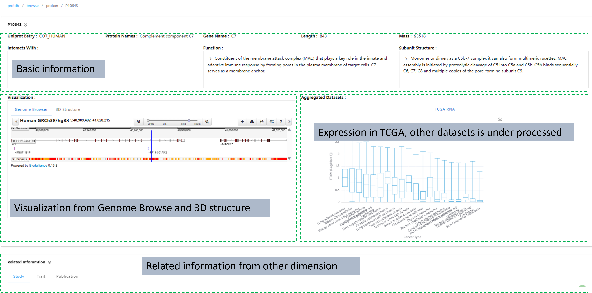
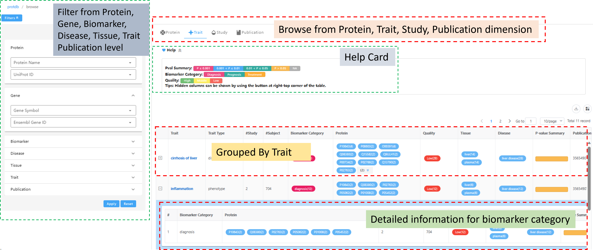
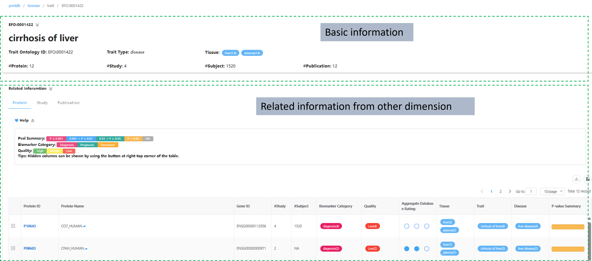
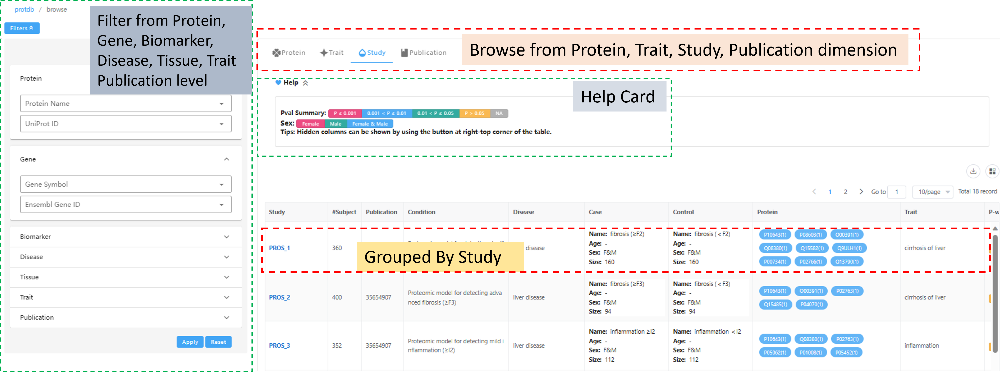
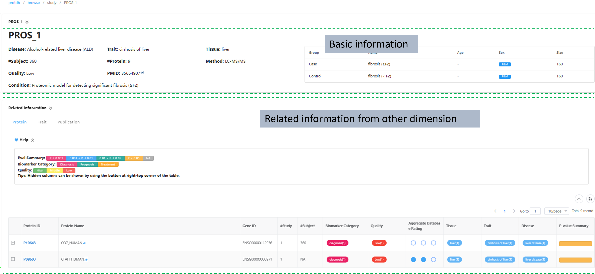
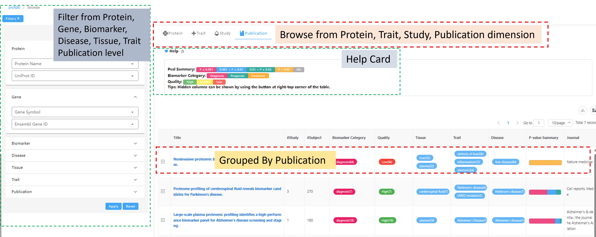
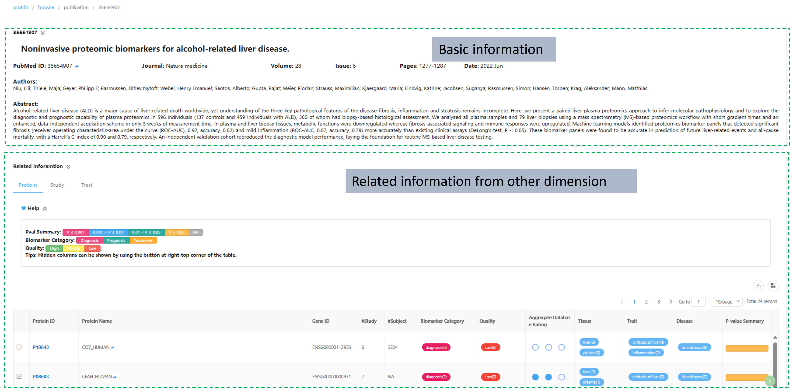

# protmarker
Curated protein biomarker database for disease.
## Project setup
```
npm install
```
### Compiles and hot-reloads for development
```
npm run serve
```
### Compiles and minifies for production
```
npm run build
```
### Customize configuration
See [Configuration Reference](https://cli.vuejs.org/config/).


# Database overview
The Browse is divided into Protein, Trait, Study, Publication dimensions. Each dimension has a summary page and a detailed page.
## Protein
### Protein summary page


### Protein detail page


## Trait
### Trait summary page


### Trait detail page


## Study
### Study summary page


### Study detail page


## Publication
### Publication summary page


### Publication detail page
